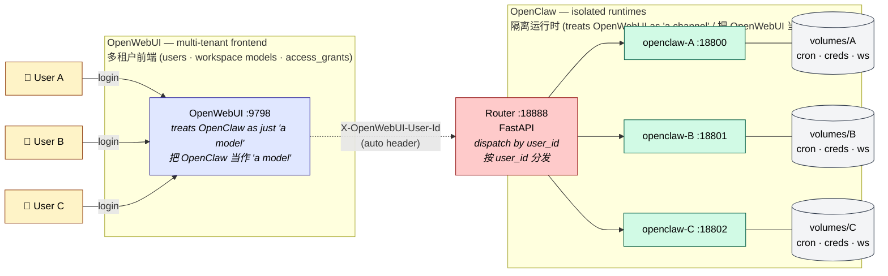

# EasyMultiTenantOpenClaw

<p align="center">
  <strong>Turn <a href="https://openclaw.ai">OpenClaw</a> into a multi-tenant backend for <a href="https://openwebui.com">OpenWebUI</a> — without modifying either.</strong><br/>
  <strong>把 <a href="https://openclaw.ai">OpenClaw</a> 变成 <a href="https://openwebui.com">OpenWebUI</a> 的多租户后端 —— 两端代码一行不改。</strong>
</p>

<p align="center">
  <a href="LICENSE"></a>
  
  
  
</p>

## The core idea / 核心思路

Two systems, two mental models, one bridge that requires zero changes on either side:

| View from | Sees the other as | Reason |
|---|---|---|
| **OpenClaw** | a _channel_ (like Telegram, Slack, Discord) | OpenWebUI is where user messages come in |
| **OpenWebUI** | a _model_ (an OpenAI-compatible backend) | OpenClaw exposes `/v1/chat/completions` |

> The bridge is purely external. **OpenClaw source: untouched. OpenWebUI source: untouched.** All we add is a thin router plus a container-per-tenant layout.

两个系统，两种心智模型，一座"两端都不改代码"的桥：
- **OpenClaw 视角**：OpenWebUI 就像 Telegram / Slack 一样，是一个消息入口 channel。
- **OpenWebUI 视角**：OpenClaw 就是一个 OpenAI 兼容的 model 后端。
- 中间这座桥**完全外挂**：OpenClaw 源码不动，OpenWebUI 源码不动。只加了一个轻量 router 和"每租户一容器"的编排。

而 OpenWebUI 原生就有多用户、workspace model、`access_grants` 这一整套多租户 UI 能力；OpenClaw 原生没有。EasyMultiTenantOpenClaw 把 **OpenWebUI 的多租户 UI 层，通过容器编排下沉到 OpenClaw**，让 OpenClaw 无需任何改动就获得企业级多租户部署能力。

## Architecture / 架构



One image (`openclaw:base`), N containers, N volumes. Nothing crosses the container boundary — cron jobs, credentials, `exec-approvals`, bash execution environments are all hard-isolated.

一个镜像 `openclaw:base`，跑 N 个容器，挂 N 个独立 volume。容器边界之外零共享 —— cron / credentials / exec-approvals / bash 执行环境全部硬隔离。

## Why this matters / 为什么需要它

| Shared resource (single OpenClaw) | Evidence | Risk |
|---|---|---|
| **Cron / 定时任务** | `~/.openclaw/cron/jobs.json` is a flat file, no `agentId` on jobs | A's schedule visible/editable by B / 用户 A 的定时任务 B 能看能改 |
| **Credentials / 凭据** | `~/.openclaw/credentials/*.json` keyed by channel, not user | A's Tavily key burned by B's quota / A 的 API key 被 B 用光 |
| **Exec approvals / 执行审批** | Global socket; `agents: {}` field declared but unwired | One approval dialog for everyone / 所有人共用一个审批弹窗 |
| **Skill runtime / Skill 运行时** | Same bash env, same provider keys across agents | B's bash reads A's files / B 的 bash 能读 A 的工作区 |

## Quick start / 快速开始

Prereqs: Docker, an OpenWebUI instance on `:9798`, admin account.
前置：Docker、运行中的 OpenWebUI（端口 9798）、管理员账号。

```bash
git clone https://github.com/haroldpku/EasyMultiTenantOpenClaw.git
cd EasyMultiTenantOpenClaw/container-orch

# 1. Build the tenant image / 构建租户镜像
docker build -t openclaw:base .

# 2. Start 3 demo tenants (ports 18800–18802) / 启动 3 个演示租户
docker compose up -d

# 3. Run the router / 启动路由
cd router && python3 -m venv .venv && .venv/bin/pip install -r requirements.txt
.venv/bin/python main.py &

# 4. Restart open-webui with ENABLE_FORWARD_USER_INFO_HEADERS=true
#    让 OpenWebUI 在转发请求时带上用户身份 header

# 5. Provision tenants end-to-end / 一键批量开通 3 个演示员工
export OWUI_ADMIN_EMAIL=admin@example.com
export OWUI_ADMIN_PASSWORD=your-password
python3 ../scripts/provision_demo_tenants.py
```

Three demo accounts (`iso-demo01@demo.local` / `Demo!Pass01`, …) are created in OpenWebUI, each locked to its own isolated container.
自动创建 3 个演示账号，每人只能访问自己的专属容器。

## Components / 组件

- **[`container-orch/`](container-orch/)** — the isolation stack / 隔离栈主体
  - `Dockerfile` + `start-openclaw.sh` — build `openclaw:base`, auto-bootstrap per-tenant gateway token on first boot
  - `link-extension-deps.sh` — fixup for bundled channel plugins (missing `@buape/carbon` etc.)
  - `docker-compose.yml` — 3 demo tenants declaration
  - `router/main.py` — FastAPI dispatcher keyed by `X-OpenWebUI-User-Id`
  - `scripts/provision_demo_tenants.py` — end-to-end: creates OpenWebUI users + adds the `openclaw-isolated` connection + builds `tenants.json` + creates per-user workspace models with `access_grants`
- **[`bridge/`](bridge/)** — admin UI for managing agents on a _shared_ OpenClaw gateway. Kept as a reference and useful during migration from shared to isolated mode.
  管理员 UI（用于共享 gateway 模式下的 agent 管理）；迁移到隔离模式时作参考。

## Verified isolation / 隔离验证

After user A creates a cron job or saves a credential:

| Check | Expected |
|---|---|
| `cat volumes/user-a/cron/jobs.json` | has the job / 有任务 |
| `cat volumes/user-b/cron/jobs.json` | empty / 空 |
| `docker exec openclaw-user-a ls /volumes/user-b` | `No such file` |
| User B tries user-a's model id in OpenWebUI | `Model not found` (blocked by `access_grants`) |

## Resource footprint / 资源占用

| Tenants | RSS | Disk | Note |
|---|---|---|---|
| 1 | ~450 MB | ~10 MB | Baseline / 基线 |
| 3 (POC) | ~1.4 GB | ~30 MB | Verified on 16 GB Mac / 16GB Mac 验证通过 |
| 100 (target) | ~45 GB | ~1 GB | Server-class; add lazy-start for laptops / 需服务器，或启用按需启动 |

## Contributing / 贡献

Issues and PRs welcome. Mention `@claude` in an issue body or title and the [Claude Code action](.github/workflows/claude.yml) will read the repo and either reply inline or open a PR.

欢迎提 issue / PR。在 issue 标题或正文里 `@claude`，[Claude Code action](.github/workflows/claude.yml) 会读取仓库内容，直接回复或开 PR。

## License

[MIT](LICENSE)
