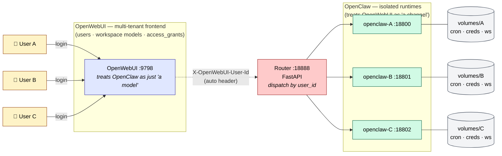

<p align="right">🌐 <strong>English</strong> · <a href="README.zh.md">中文</a></p>

# EasyMultiTenantOpenClaw

<p align="center">
  <strong>Turn <a href="https://openclaw.ai">OpenClaw</a> into a multi-tenant backend for <a href="https://openwebui.com">OpenWebUI</a> — without modifying either.</strong>
</p>

<p align="center">
  <a href="LICENSE"></a>
  
  
  
</p>

## The core idea

Two systems, two mental models, one bridge that requires zero changes on either side:

| View from | Sees the other as | Reason |
|---|---|---|
| **OpenClaw** | a _channel_ (like Telegram, Slack, Discord) | OpenWebUI is where user messages come in |
| **OpenWebUI** | a _model_ (an OpenAI-compatible backend) | OpenClaw exposes `/v1/chat/completions` |

> The bridge is purely external. **OpenClaw source: untouched. OpenWebUI source: untouched.** All we add is a thin router plus a container-per-tenant layout.

OpenWebUI already ships a full multi-tenant UI stack — users, workspace models, `access_grants`. OpenClaw doesn't. EasyMultiTenantOpenClaw **pushes OpenWebUI's multi-tenant UI layer down into OpenClaw via container orchestration**, giving OpenClaw enterprise-grade multi-tenancy without touching a line of its code.

## Architecture



One image (`openclaw:base`), N containers, N volumes. Nothing crosses the container boundary — cron jobs, credentials, `exec-approvals`, bash execution environments are all hard-isolated.

## Why this matters

| Shared resource (single OpenClaw) | Evidence | Risk |
|---|---|---|
| **Cron** | `~/.openclaw/cron/jobs.json` is a flat file, no `agentId` on jobs | A's schedule visible/editable by B |
| **Credentials** | `~/.openclaw/credentials/*.json` keyed by channel, not user | A's Tavily key burned by B's quota |
| **Exec approvals** | Global socket; `agents: {}` field declared but unwired | One approval dialog for everyone |
| **Skill runtime** | Same bash env, same provider keys across agents | B's bash reads A's files |

## Quick start

One line on a clean Ubuntu 22.04 / 24.04 host. Installs everything — OpenWebUI, the tenant image, 3 isolated OpenClaw containers, the router, and 3 demo users fully wired up.

```bash
bash <(curl -fsSL https://raw.githubusercontent.com/haroldpku/EasyMultiTenantOpenClaw/main/install.sh)
```

The installer asks for three things interactively — pre-set them as env vars to skip the prompts (useful in CI):

```bash
ADMIN_EMAIL=admin@example.com \
ADMIN_PASSWORD=your-password \
DASHSCOPE_KEY=sk-xxxxxxxx \
bash <(curl -fsSL https://raw.githubusercontent.com/haroldpku/EasyMultiTenantOpenClaw/main/install.sh)
```

What happens in ~3 minutes:

| Step | Action |
|---|---|
| 1 | Preflight: docker, git, curl, python3 |
| 2 | Clone repo to `~/EasyMultiTenantOpenClaw` |
| 3 | Prompt for admin email / password / Dashscope API key |
| 4 | Start OpenWebUI container on `:9798` with `ENABLE_FORWARD_USER_INFO_HEADERS=true` |
| 5 | Register admin via `/api/v1/auths/signup` |
| 6 | Build `openclaw:base` (~1.7 GB, once) |
| 7 | `docker compose up -d` — router + 3 tenant containers |
| 8 | Inject Dashscope provider config into each tenant volume + provision users |
| 9 | Print summary with 3 demo account credentials |

Three demo accounts (`iso-demo01@demo.local` / `Demo!Pass01`, …) get created in OpenWebUI, each locked to its own isolated container.

<details>
<summary>Manual install steps (fallback)</summary>

```bash
git clone https://github.com/haroldpku/EasyMultiTenantOpenClaw.git ~/EasyMultiTenantOpenClaw
cd ~/EasyMultiTenantOpenClaw/container-orch

docker run -d --name open-webui -p 9798:8080 \
  -v open-webui:/app/backend/data \
  --add-host host.docker.internal:host-gateway \
  -e WEBUI_AUTH=true -e ENABLE_OPENAI_API=true \
  -e ENABLE_FORWARD_USER_INFO_HEADERS=true \
  --restart unless-stopped ghcr.io/open-webui/open-webui:main

docker build -t openclaw:base .
echo '{"version":1,"tenants":{}}' > tenants.json
mkdir -p volumes/demo01 volumes/demo02 volumes/demo03
docker compose up -d --build

export OWUI_ADMIN_EMAIL=admin@example.com OWUI_ADMIN_PASSWORD=pw
python3 scripts/provision_demo_tenants.py
```

</details>

## Components

- **[`container-orch/`](container-orch/)** — the isolation stack
  - `Dockerfile` + `start-openclaw.sh` — build `openclaw:base`, auto-bootstrap per-tenant gateway token on first boot
  - `link-extension-deps.sh` — fixup for bundled channel plugins (missing `@buape/carbon` etc.)
  - `docker-compose.yml` — 3 demo tenants + router declaration
  - `router/main.py` — FastAPI dispatcher keyed by `X-OpenWebUI-User-Id`
  - `scripts/provision_demo_tenants.py` — creates OpenWebUI users + adds the `openclaw-isolated` connection + builds `tenants.json` + creates per-user workspace models with `access_grants`
- **[`bridge/`](bridge/)** — admin UI for managing agents on a _shared_ OpenClaw gateway. Kept as a reference and useful during migration from shared to isolated mode.

## Verified isolation

After user A creates a cron job or saves a credential:

| Check | Expected |
|---|---|
| `cat volumes/user-a/cron/jobs.json` | has the job |
| `cat volumes/user-b/cron/jobs.json` | empty |
| `docker exec openclaw-user-a ls /volumes/user-b` | `No such file` |
| User B tries user-a's model id in OpenWebUI | `Model not found` (blocked by `access_grants`) |

## Resource footprint

| Tenants | RSS | Disk | Note |
|---|---|---|---|
| 1 | ~450 MB | ~10 MB | Baseline |
| 3 (POC) | ~1.4 GB | ~30 MB | Verified on 16 GB Mac |
| 100 (target) | ~45 GB | ~1 GB | Server-class; add lazy-start for laptops |

## Contributing

Issues and PRs welcome. Mention `@claude` in an issue body or title and the [Claude Code action](.github/workflows/claude.yml) will read the repo and either reply inline or open a PR. See [setup guide](.github/CLAUDE-ACTION-SETUP.md) for the required secrets (supports third-party Anthropic proxies).

## License

[MIT](LICENSE)
