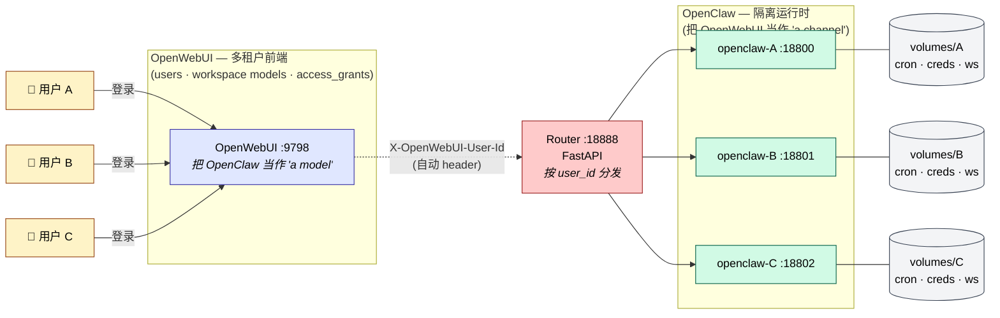

<p align="right">🌐 <a href="README.md">English</a> · <strong>中文</strong></p>

# EasyMultiTenantOpenClaw

<p align="center">
  <strong>把 <a href="https://openclaw.ai">OpenClaw</a> 变成 <a href="https://openwebui.com">OpenWebUI</a> 的多租户后端 —— 两端代码一行不改。</strong>
</p>

<p align="center">
  <a href="LICENSE"></a>
  
  
  
</p>

## 核心思路

两个系统，两种心智模型，一座"两端都不改代码"的桥：

| 从谁的视角看 | 把对方当作 | 原因 |
|---|---|---|
| **OpenClaw** | 一个 _channel_（像 Telegram、Slack、Discord）| OpenWebUI 是用户消息的入口 |
| **OpenWebUI** | 一个 _model_（OpenAI 兼容后端）| OpenClaw 暴露了 `/v1/chat/completions` |

> 这座桥完全外挂。**OpenClaw 源码：一行不动。OpenWebUI 源码：一行不动。** 我们加的只是一个轻量 router 和"每租户一容器"的编排。

OpenWebUI 原生就有多用户、workspace model、`access_grants` 这一整套多租户 UI 能力；OpenClaw 原生没有。EasyMultiTenantOpenClaw **把 OpenWebUI 的多租户 UI 层，通过容器编排下沉到 OpenClaw**，让 OpenClaw 无需任何改动就获得企业级多租户部署能力。

## 架构



一个镜像 `openclaw:base`，跑 N 个容器，挂 N 个独立 volume。容器边界之外零共享 —— cron / credentials / exec-approvals / bash 执行环境全部硬隔离。

## 为什么需要它

| 共享资源（单 OpenClaw）| 证据 | 风险 |
|---|---|---|
| **Cron** | `~/.openclaw/cron/jobs.json` 是平铺文件, job 条目无 `agentId` | 用户 A 的定时任务 B 能看能改 |
| **凭据 Credentials** | `~/.openclaw/credentials/*.json` 按 channel 分, 不按 user 分 | A 的 Tavily API key 被 B 用光 |
| **执行审批** | 全局单 socket, `agents: {}` 字段已定义但未实装 | 所有人共用一个审批弹窗 |
| **Skill 运行时** | 同一 bash 环境, 同一 provider keys | B 的 bash 能读 A 的工作区 |

## 快速开始

干净的 Ubuntu 22.04 / 24.04 主机上一条命令。全栈装齐 —— OpenWebUI、租户镜像、3 个隔离的 OpenClaw 容器、router、3 个演示用户绑定全部就位。

```bash
bash <(curl -fsSL https://raw.githubusercontent.com/haroldpku/EasyMultiTenantOpenClaw/main/install.sh)
```

安装器会交互询问 3 样信息；想免交互（适合 CI）就用环境变量预置：

```bash
ADMIN_EMAIL=admin@example.com \
ADMIN_PASSWORD=your-password \
DASHSCOPE_KEY=sk-xxxxxxxx \
bash <(curl -fsSL https://raw.githubusercontent.com/haroldpku/EasyMultiTenantOpenClaw/main/install.sh)
```

约 3 分钟内完成的 9 步：

| 步骤 | 动作 |
|---|---|
| 1 | Preflight: 检查 docker / git / curl / python3 |
| 2 | Clone repo 到 `~/EasyMultiTenantOpenClaw` |
| 3 | 提示输入 admin 邮箱 / 密码 / Dashscope API key |
| 4 | 启动 OpenWebUI 容器 (`:9798`, `ENABLE_FORWARD_USER_INFO_HEADERS=true`) |
| 5 | 调 `/api/v1/auths/signup` 注册 admin |
| 6 | Build `openclaw:base` (~1.7 GB, 仅首次) |
| 7 | `docker compose up -d` — router + 3 个租户容器 |
| 8 | 把 Dashscope provider 配置注入到每个租户 volume + 执行 provision |
| 9 | 打印凭据总结 |

自动创建 3 个演示账号 (`iso-demo01@demo.local` / `Demo!Pass01`, …), 每人只能访问自己的专属容器。

<details>
<summary>手动安装步骤（备用）</summary>

```bash
git clone https://github.com/haroldpku/EasyMultiTenantOpenClaw.git ~/EasyMultiTenantOpenClaw
cd ~/EasyMultiTenantOpenClaw/container-orch

docker run -d --name open-webui -p 9798:8080 \
  -v open-webui:/app/backend/data \
  --add-host host.docker.internal:host-gateway \
  -e WEBUI_AUTH=true -e ENABLE_OPENAI_API=true \
  -e ENABLE_FORWARD_USER_INFO_HEADERS=true \
  --restart unless-stopped ghcr.io/open-webui/open-webui:main

docker build -t openclaw:base .
echo '{"version":1,"tenants":{}}' > tenants.json
mkdir -p volumes/demo01 volumes/demo02 volumes/demo03
docker compose up -d --build

export OWUI_ADMIN_EMAIL=admin@example.com OWUI_ADMIN_PASSWORD=pw
python3 scripts/provision_demo_tenants.py
```

</details>

## 组件

- **[`container-orch/`](container-orch/)** — 隔离栈主体
  - `Dockerfile` + `start-openclaw.sh` — 构建 `openclaw:base` 镜像, 首次启动自动生成租户 gateway token
  - `link-extension-deps.sh` — 修复 bundled channel plugin 的 deps 查找路径（如 `@buape/carbon` 等）
  - `docker-compose.yml` — 声明 3 个演示租户 + router
  - `router/main.py` — FastAPI 路由, 按 `X-OpenWebUI-User-Id` 分发
  - `scripts/provision_demo_tenants.py` — 端到端开通: 建 OpenWebUI user + 加 `openclaw-isolated` connection + 写 `tenants.json` + 建带 `access_grants` 的 workspace model
- **[`bridge/`](bridge/)** — 共享 gateway 模式下的 agent 管理 UI。作为参考，或从共享模式迁移到隔离模式时可用。

## 隔离验证

在用户 A 建了 cron 任务或存了凭据后:

| 检查 | 预期 |
|---|---|
| `cat volumes/user-a/cron/jobs.json` | 有任务 |
| `cat volumes/user-b/cron/jobs.json` | 空 |
| `docker exec openclaw-user-a ls /volumes/user-b` | `No such file` |
| 用户 B 在 OpenWebUI 里用 user-a 的 model id | `Model not found` (被 `access_grants` 拦截) |

## 资源占用

| 租户数 | RSS | 磁盘 | 备注 |
|---|---|---|---|
| 1 | ~450 MB | ~10 MB | 基线 |
| 3 (POC) | ~1.4 GB | ~30 MB | 16 GB Mac 验证通过 |
| 100 (目标) | ~45 GB | ~1 GB | 需服务器级；笔记本需要启用 lazy-start |

## 贡献

欢迎提 issue / PR。在 issue 标题或正文里 `@claude`，[Claude Code action](.github/workflows/claude.yml) 会读取仓库内容，直接回复或开 PR。配置说明（含第三方 Anthropic 代理支持）见 [setup guide](.github/CLAUDE-ACTION-SETUP.md)。

## License

[MIT](LICENSE)
