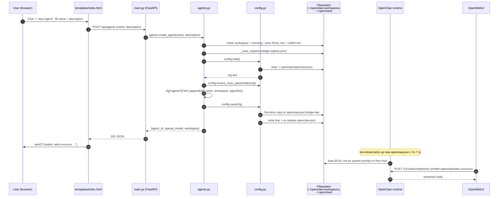

# `bridge/` Module Deep Dive

This document is a source-of-truth map for every file under `bridge/`. It is
written from a line-by-line read of the actual source and should let a new
contributor understand the surface area, control flow, and side effects of the
bridge without re-reading the code.

---

## 1. High-Level Overview: OpenWebUI → bridge → OpenClaw

The bridge is a small FastAPI service (`main.py`) that lets a human manage a
pool of OpenClaw "agents" from a browser without hand-editing
`~/.openclaw/openclaw.json`. It is deliberately **not** on the inference hot
path — chat traffic flows directly from OpenWebUI to OpenClaw's OpenAI-
compatible endpoint. The bridge only mutates the *configuration* that OpenClaw
reads, and the isolated on-disk workspaces each agent uses.

Conceptually there are two independent request flows:

1. **Management flow (what this bridge serves).** The user opens the browser
   at the bridge root (`GET /`) and gets an HTML page listing all
   `web-`-prefixed agents. Clicking *New Agent* posts to `POST /api/agents`,
   which creates a workspace on disk (`~/openclaw-workspaces/<id>/` with
   `SOUL.md`, `USER.md`, `memory/`), appends an entry to
   `~/.openclaw/openclaw.json`, and records bridge-only metadata in
   `~/openclaw-workspaces/.bridge-registry.json`. Deletion is symmetric and
   moves the workspace to a `.trash/` folder instead of unlinking it.

2. **Chat flow (handled entirely by OpenClaw, not by this bridge).** Once an
   agent exists, OpenWebUI sees it as a model named `openclaw/<id>` and sends
   chat completions to OpenClaw's OpenAI-compatible endpoint. OpenClaw reads
   the same `openclaw.json` (hot-reloaded within ~5–7 s per the UI hint),
   resolves the agent, loads its `SOUL.md` as the system prompt, and replies.
   The bridge is completely out of this loop.

The bridge's only guarantees are therefore:

- It never touches agent entries whose id does not start with `web-`
  (see `BRIDGE_PREFIX` in `agents.py`). The user's hand-crafted `main`, `ops`,
  `sales`, etc. agents are untouchable by bridge endpoints.
- It preserves OpenClaw's fallback behaviour where an empty `agents.list`
  produces a default `main` agent — by inserting a minimal `main` placeholder
  the first time it ever appends to the list
  (`config.ensure_main_placeholder`).
- Config writes are atomic (`tmp` file + `os.replace`) and backed up once to
  `openclaw.json.bridge-bak` before the first bridge-initiated write.

---

## 2. Per-File Reference

### 2.1 `bridge/main.py` — HTTP surface

**Purpose.** Define the FastAPI application, wire the Jinja2 template, and
expose four endpoints that delegate to `agents.py`.

**Module-level objects.**

- `app: FastAPI` — application instance, `title="openclaw-bridge"`,
  `version="0.1.0"`.
- `templates: Jinja2Templates` — pointed at `bridge/templates/`. The directory
  is resolved relative to `__file__`, so the app works regardless of the CWD
  of the process.

**Classes.**

- `CreateAgentBody(BaseModel)` — request body for agent creation.
  - `name: str` (`min_length=1`, `max_length=100`) — required.
  - `description: str` (default `""`, `max_length=4000`) — becomes the
    agent's `SOUL.md` content and hence its system prompt.

**Functions / route handlers.**

- `index(request: Request) -> HTMLResponse` — `GET /`. Calls
  `agents.list_agents()` and renders `templates/index.html` with the list as
  `agents`.
- `api_list() -> list[dict]` — `GET /api/agents`. Thin pass-through to
  `agents.list_agents()`.
- `api_create(body: CreateAgentBody) -> dict` — `POST /api/agents`. Calls
  `agents.create_agent(body.name, body.description)`. Translates
  `ValueError` into HTTP 400.
- `api_delete(agent_id: str) -> dict` — `DELETE /api/agents/{agent_id}`.
  Translates `PermissionError` (non-bridge id) to 403 and `LookupError`
  (unknown id) to 404. Returns `{"ok": True}` on success.

**Dependencies.** Imports `fastapi`, `pydantic`, `jinja2` (via
`fastapi.templating`), `pathlib.Path`, and the sibling `agents` module. When
run as `__main__`, imports `uvicorn` lazily and binds to `127.0.0.1:18790`
with `log_level="info"`. The bind address is hard-coded: the bridge
intentionally does not expose itself on the network.

**Call relationships.** `main.py` is a pure HTTP adapter — all mutation,
validation beyond Pydantic shape checks, and filesystem work lives in
`agents.py`. There is no background task, no lifespan hook, and no shared
mutable state inside `main.py` itself.

---

### 2.2 `bridge/agents.py` — Agent CRUD and workspace lifecycle

**Purpose.** The business logic of the bridge. Implements the invariant that
bridge-managed agents are exactly those with id prefix `web-`, owns the
metadata registry, and performs coordinated multi-step mutations on the
filesystem and on `openclaw.json`.

**Module-level constants.**

- `WORKSPACE_ROOT = Path.home() / "openclaw-workspaces"` — parent directory
  for every bridge-created agent workspace.
- `TRASH_ROOT = WORKSPACE_ROOT / ".trash"` — destination for deleted
  workspaces. Deletion is soft; the directory is moved, not removed.
- `REGISTRY = WORKSPACE_ROOT / ".bridge-registry.json"` — bridge-only
  metadata store. Holds `description` and `created_at` per agent, which are
  deliberately kept out of `openclaw.json` so that file continues to pass
  OpenClaw's schema without bridge-specific fields.
- `BRIDGE_PREFIX = "web-"` — the scoping primitive. Every public function
  uses this to refuse to act on non-bridge agents.

**Internal helpers.**

- `_iso_now() -> str` — UTC `datetime.now(...).isoformat(timespec="seconds")`;
  used for `created_at` and as a timestamp suffix in trash directory names.
- `_new_agent_id() -> str` — `"web-" + secrets.token_hex(4)`, i.e. 8 hex
  characters of entropy. The comment calls this "collision-safe for a single
  user" — there is no explicit collision check.
- `_workspace_abs(agent_id: str) -> Path` — returns
  `WORKSPACE_ROOT / agent_id`.
- `_load_registry() -> dict` — reads `REGISTRY` if present, otherwise returns
  `{"agents": {}}`.
- `_save_registry(reg: dict) -> None` — atomic write via `tmp` + `os.replace`;
  creates `REGISTRY.parent` if missing.

**Public API.**

- `list_agents() -> list[dict]`. Joins `config.load()["agents"]["list"]`
  (filtered to `web-` ids) with `_load_registry()`. Returns dicts of
  `id`, `name`, `description`, `workspace`, `created_at`.
- `create_agent(name: str, description: str) -> dict`. Three ordered steps
  with a best-effort rollback:
  1. Create `WORKSPACE_ROOT / <id>/` and `memory/` subdirectory, then write
     `SOUL.md` (containing the description, falling back to `name`) and
     `USER.md` (with `getpass.getuser()` and the creation timestamp).
  2. Insert the agent into the bridge registry.
  3. Load `openclaw.json`, call `config.ensure_main_placeholder(cfg)` so the
     user's implicit `main` agent is not lost the first time the list is
     populated, append the new entry (including `id`, `name`, `workspace`,
     and an explicit `agentDir` under the workspace so OpenClaw keeps all
     per-agent state co-located), and `config.save(cfg)`.

  Returns `{"agent_id", "openai_model", "workspace"}`. On any exception after
  step 1 the workspace directory is `shutil.rmtree`'d and the registry entry
  is rolled back.
- `delete_agent(agent_id: str) -> None`. Enforces the prefix check first
  (raising `PermissionError` otherwise), then removes the entry from
  `openclaw.json` (raising `LookupError` if absent), drops the registry
  entry, moves the workspace to `.trash/<id>_<ts>/`, and as a belt-and-
  braces step also moves any stranded `~/.openclaw/agents/<id>/` directory
  that might exist from legacy agents into `.trash/`.

**Dependencies.** `getpass`, `json`, `os`, `secrets`, `shutil`,
`datetime.datetime`, `datetime.timezone`, `pathlib.Path`, and the sibling
`config` module. No third-party libraries.

**Call relationships.**
`main.api_list` → `agents.list_agents` → `config.load`.
`main.api_create` → `agents.create_agent` → `config.load` +
`config.ensure_main_placeholder` + `config.save`.
`main.api_delete` → `agents.delete_agent` → `config.load` + `config.save`.

---

### 2.3 `bridge/config.py` — `openclaw.json` I/O

**Purpose.** Read and atomically write `~/.openclaw/openclaw.json`, and
protect OpenClaw's implicit `main` agent from disappearing the first time the
bridge appends to `agents.list`.

**Module-level constants.**

- `OPENCLAW_JSON = Path.home() / ".openclaw" / "openclaw.json"`.
- `BRIDGE_BAK = Path.home() / ".openclaw" / "openclaw.json.bridge-bak"`.
- `MAIN_AGENT_ID = "main"`.

**Functions.**

- `load() -> dict[str, Any]`. `json.load` of `OPENCLAW_JSON`. No defaults,
  no error translation — callers get the raw file.
- `save(cfg: dict) -> None`. If `BRIDGE_BAK` does not yet exist, copies the
  current `OPENCLAW_JSON` aside as a one-shot pristine backup. Writes
  `cfg` to a sibling `.json.tmp` file and `os.replace`s it over the real
  file, giving atomic swap semantics.
- `ensure_main_placeholder(cfg: dict) -> None`. If `agents.list` already
  contains an entry whose `id == "main"`, do nothing. Otherwise insert
  `{"id": "main", "name": "Main", "default": True}` at index 0. The entry
  omits `workspace` on purpose so that OpenClaw's
  `resolveAgentWorkspaceDir` falls back to `agents.defaults.workspace`,
  preserving whatever the user configured there. The docstring cites
  `src/agents/agent-scope.ts:63-78` of OpenClaw as the exact code path that
  motivates this function.

**Dependencies.** `json`, `os`, `shutil`, `pathlib.Path`, `typing.Any`. No
third-party or sibling-module dependencies — `config.py` is a leaf.

---

### 2.4 `bridge/templates/index.html` — Management UI

**Purpose.** The only template. Renders a table of existing agents (server-
side Jinja2 loop over `agents`) and two JavaScript helpers that call the
JSON API.

**Server-side variables consumed.**

- `agents`: list of dicts with `name`, `id`, `description`, `created_at`. The
  template truncates `description` to 80 characters with an ellipsis.
- `request`: standard FastAPI/Jinja2 context object (required by
  `TemplateResponse`).

**Client-side functions.**

- `toggleForm()` — shows/hides the create form.
- `submitCreate()` — reads `#f-name` / `#f-desc`, `POST`s JSON to
  `/api/agents`, alerts on non-2xx, and on success alerts the new
  `agent_id` / `openai_model` and calls `location.reload()`. Includes a hint
  that OpenWebUI's model list takes 5–7 s to hot-reload.
- `deleteAgent(id, name)` — `confirm` prompt, then `DELETE
  /api/agents/{id}`, alerting on error and reloading on success.

**Dependencies.** None external; the CSS is inline and there is no JS
framework. The page uses only `fetch`, `alert`, `confirm`, and
`location.reload`.

---

### 2.5 `bridge/requirements.txt`

Pins the runtime stack: `fastapi>=0.110`, `uvicorn[standard]>=0.27`,
`jinja2>=3.1`, `pydantic>=2.5`. All four are runtime-only; there is no test
or lint tooling declared at this layer.

---

## 3. End-to-End Sequence Diagram

The diagram traces "user clicks *Create* in the bridge UI" all the way to
"OpenWebUI can talk to the new agent". Steps 1–11 are entirely the bridge;
steps 12–15 cross the boundary into OpenClaw and OpenWebUI and are shown for
completeness.

---

## 4. Environment Variables Read by `config.py`

`config.py` does **not** read any environment variables directly. It has no
`os.environ` / `os.getenv` calls; every path it touches is derived from
`Path.home()`:

| Path constant  | Value                                         | Source                  |
| -------------- | --------------------------------------------- | ----------------------- |
| `OPENCLAW_JSON`| `~/.openclaw/openclaw.json`                   | `Path.home()` + literal |
| `BRIDGE_BAK`   | `~/.openclaw/openclaw.json.bridge-bak`        | `Path.home()` + literal |
| `MAIN_AGENT_ID`| `"main"` (string literal, not a path)         | literal                 |

`Path.home()` transitively consults environment variables through CPython's
`os.path.expanduser` / `pathlib` implementation — on POSIX it reads `HOME`
(falling back to the user's passwd entry), and on Windows it consults
`USERPROFILE` / `HOMEDRIVE`+`HOMEPATH`. Those are the **only** environment
variables that can influence `config.py`'s behaviour, and they are
indirect — the module itself declares no configuration knobs.

For completeness, the same observation holds for the rest of the bridge:
`agents.py` also derives all paths from `Path.home()` (and uses
`getpass.getuser()` for the `USER.md` author line, which on POSIX reads
`LOGNAME` / `USER` / `LNAME` / `USERNAME` in turn), and `main.py` hard-codes
`127.0.0.1:18790` with no env-var override. If you want to relocate the
workspace root, change the bind address, or point at a non-default
`openclaw.json`, today the only option is a source edit.
