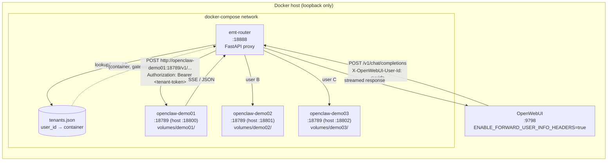

# Container networking & request routing

This document describes how the `container-orch/` stack is wired together:
which containers exist, how they are reachable on the host and on the
compose-internal network, how a user's chat request is dispatched to
the correct per-tenant OpenClaw gateway, and what goes wrong most often.
It is intentionally a reference doc — nothing here changes behaviour;
the code of record is `docker-compose.yml`, `router/main.py`, and
`tenants.example.json`.

## 1. Services declared in `docker-compose.yml`

Four long-running services are declared, all on the default compose
network created for this project:

1. `router` — the edge dispatcher (`emt-router`).
2. `openclaw-demo01` — tenant #1 OpenClaw gateway.
3. `openclaw-demo02` — tenant #2 OpenClaw gateway.
4. `openclaw-demo03` — tenant #3 OpenClaw gateway.

The router is the only service with an entry-point open to upstream
consumers (OpenWebUI). The three `openclaw-demoXX` services publish
ports on `127.0.0.1` purely for operator debugging; normal traffic
from the router uses the compose-internal DNS name and port 18789.

## 2. Per-service reference

### 2.1 `router`

- **Image**: built from `./router` (Dockerfile), tagged `emt-router:latest`.
- **Container name**: `emt-router`.
- **Purpose**: FastAPI proxy that reads `X-OpenWebUI-User-Id`, looks
  up the user in `tenants.json`, and forwards the request to the
  matching OpenClaw container with that tenant's gateway token.
- **Ports**: `127.0.0.1:18888 → 18888`. Bound to loopback so the
  router is only reachable from the host. OpenWebUI (a separate
  container, not in this compose) reaches it via
  `http://host.docker.internal:18888/v1`.
- **Env**: `ROUTER_PORT=18888`, `TENANTS_FILE=/app/tenants.json`
  (both set in the router Dockerfile).
- **Volumes**: `./tenants.json:/app/tenants.json:ro` — read-only
  bind mount; the router hot-reloads this file by mtime, so
  re-running the provisioning script updates routing without a
  container restart.
- **depends_on**: none declared. The `router/tenants.py` loader
  tolerates a missing or empty `tenants.json` (returns an empty
  mapping), so the router can start before tenants are provisioned.
- **Restart**: `unless-stopped`.

### 2.2 `openclaw-demo01`, `openclaw-demo02`, `openclaw-demo03`

These three services are identical except for the tenant index.

- **Image**: `openclaw:base` (built locally from the top-level
  `Dockerfile`).
- **Container names**: `openclaw-demo01`, `openclaw-demo02`,
  `openclaw-demo03`. The router uses these exact names as upstream
  DNS targets.
- **Purpose**: a full single-tenant OpenClaw gateway. Each
  container owns its own cron schedule, credentials store,
  exec-approval socket, sessions, and memory; nothing is shared
  with peers.
- **Ports**: `127.0.0.1:18800 → 18789`, `127.0.0.1:18801 → 18789`,
  `127.0.0.1:18802 → 18789`. Container-internal gateway port is
  always `18789` (set by `start-openclaw.sh`); the host-side port
  differs per tenant so operators can `curl` an individual gateway
  directly for debugging.
- **Env**: inherited from the Dockerfile — `OPENCLAW_STATE_DIR=/data`,
  `OPENCLAW_CONFIG_PATH=/data/openclaw.json`, `HOME=/data`. No
  compose-level overrides.
- **Volumes**: `./volumes/demoXX:/data`. One host directory per
  tenant; this is the single root of tenant state and the only
  thing `provision_demo_tenants.py` needs to read to discover the
  gateway token.
- **depends_on**: none. Tenants are independent of each other and
  of the router.
- **Restart**: `unless-stopped`.

## 3. Tenant request routing flow

The diagram below traces a single chat-completion request from
OpenWebUI through the edge router into the correct tenant
container. `GET /v1/models` is the one exception: it is a
connection-level probe from OpenWebUI that arrives without a user
header, and the router fans it out to an arbitrary tenant so
OpenWebUI can register the base model ids.

Key properties of this flow:

- The router **rewrites** the `Authorization` header: OpenWebUI's
  per-connection placeholder key is dropped, and the tenant's
  32-char hex token (seeded on first boot by `start-openclaw.sh`)
  is injected instead.
- Upstream hop-by-hop headers (`host`, `connection`,
  `transfer-encoding`) are stripped.
- Streaming is auto-detected from the `Accept: text/event-stream`
  header or a `"stream": true` body hint, and proxied chunk-by-chunk.
- Missing header → `400`, unknown user → `404`; both logged but
  never fatal to the router.

## 4. How `tenants.example.json` drives orchestration

`tenants.example.json` is the schema template for the runtime
`tenants.json`, which is what actually drives routing. The example
contains placeholder values; the real file is produced by
`scripts/provision_demo_tenants.py` after the containers have come
up for the first time.

Each entry is keyed by **OpenWebUI user id** (a UUID) and carries
five fields:

- `port` — host-mapped port for that tenant's container. Used only
  by operators; the router talks to the container by name on port
  `18789` internally.
- `profile` — short label (`demo01`, `demo02`, …). Matches the
  `volumes/<profile>/` host directory.
- `container` — compose service/container name. This string is
  joined with `:18789` to build the upstream URL in
  `router/main.py::_upstream`.
- `gateway_token` — 32-char hex token seeded by
  `start-openclaw.sh` on first boot and scraped back out by the
  provisioner from `volumes/<profile>/openclaw.json`. The router
  injects it as `Authorization: Bearer …` on every forwarded
  request.
- `openwebui_model_id` — the workspace model id in OpenWebUI that
  is bound (via `access_grants`) exclusively to this user.

The orchestration story therefore has two halves:

1. **Compose declares the containers** (names, ports, volumes)
   statically. It always brings up exactly the services named in
   `docker-compose.yml` and nothing more.
2. **`tenants.json` declares the user → container binding**
   dynamically. Editing this file — or atomically rewriting it via
   `provision_demo_tenants.py` — changes which user hits which
   container *without* touching compose. The router picks up the
   new mtime on the next request.

Adding a fourth tenant therefore requires both halves: append a
service block to `docker-compose.yml` **and** append a tenants-map
entry (after provisioning a user and capturing its gateway token).
Neither half alone is enough.

## 5. Common troubleshooting

### 5.1 `400 missing x-openwebui-user-id header`

The router received a request that wasn't from OpenWebUI, or
OpenWebUI does not have `ENABLE_FORWARD_USER_INFO_HEADERS=true` in
its environment. Check OpenWebUI's compose env and restart it; a
browser refresh is not enough because the header is added
server-side by OpenWebUI's admin-side config.

### 5.2 `404 no tenant for this user`

`tenants.json` has no entry for the user id in the header. Two
common causes: (a) the user was created in OpenWebUI but the
provisioning script was not re-run, so their id is absent from the
map; (b) the provisioning script ran but the router is reading a
stale cached file — the cache invalidates on mtime change, so
touch the file or check the bind-mount path.

### 5.3 Router cannot reach `openclaw-demoXX:18789`

Almost always means the containers are not in the same compose
network, or the router is being run from the host (e.g. via
`uvicorn main:app` at dev time) where service names do not resolve.
Either run the router through `docker compose up` so DNS works, or
swap the upstream in `_upstream()` for `http://127.0.0.1:{port}`
when iterating locally.

### 5.4 Gateway returns `401 unauthorized`

The token in `tenants.json` does not match the one in
`volumes/<profile>/openclaw.json`. This happens if the volume was
purged (token regenerates on next first-boot) but `tenants.json`
was not regenerated. Re-run `scripts/provision_demo_tenants.py` —
it is idempotent and rewrites the file atomically.

### 5.5 Cron/credentials appearing for the wrong user

Isolation is per-volume, so this means two users are pointing at
the same container in `tenants.json`. Grep the file for duplicate
`container` values; only `provision_demo_tenants.py` should be
writing it, and it enforces one-to-one.

### 5.6 `GET /v1/models` returns an empty list

`tenants.all_tenants()` is empty. The router intentionally returns
`{"object": "list", "data": []}` rather than erroring in this
case, so OpenWebUI can still register the connection. Provision
at least one tenant, then the probe will proxy to that tenant and
return the real model ids.

### 5.7 Container restart loses the token

It should not: `start-openclaw.sh` only seeds the config when
`/data/openclaw.json` does not exist. If you see token churn
across restarts, the `./volumes/demoXX` bind mount has been
pointed at a fresh directory — check the compose `volumes:` block
and confirm the host path still has the expected `openclaw.json`.
